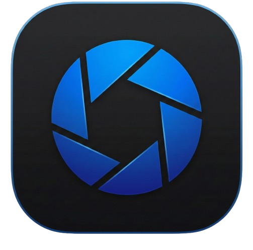

# <p align="center">The Uprising Screenrecorder</p>

<p align="center">
  
</p>

<p align="center"><strong>A professional-grade, high-performance screen recording and editing suite.</strong></p>

The Uprising Screenrecorder is an advanced evolution of the OpenScreen project, redesigned for visual excellence and production-ready workflows. It provides a stunning blue-themed interface, Premiere Pro-style dashboard, and advanced features for creating high-quality product demos and walkthroughs.

## 📱 Mobile Connection (Dashboard)

Access your video ideas and notes from your phone:
1. Ensure your phone and computer are on the **same Wi-Fi network**.
2. Look for the **Mobile Access** URL in the application dashboard (e.g., `http://192.168.1.15:3001`).
3. Open your mobile browser and enter the address.
4. Plan your viral videos on the go!

---

## 🚀 Key Features

- **Advanced Recording**: Capture high-definition screen recordings with simultaneous **System Audio**, **Microphone**, and **WebCam (PiP)** capture.
- **Temporal Control**: Adjust playback speed from **0.5x to 4x** with high-fidelity temporal scaling during export.
- **Project Dashboard**: Premiere Pro-style Home view for managing recent projects, thumbnails, and planning notes.
- **Smart Annotations**: Add text, arrows, and images with **custom font support** for a unique brand identity.
- **AI-Powered Insights**: "Video Ideas" board with automatic downloader integration (`yt-dlp`) for YouTube and Instagram references.
- **Precision Editing**: Manual zooms with customizable depth, motion blur, and precise timeline trimming.
- **Hardware Optimized**: Automatic system tier detection for optimal performance on any hardware.
- **AI-Powered Captions**: Automatic subtitle generation with high-fidelity rendering during export.
- **Export Versatility**: Export in MP4 or GIF with configurable quality, aspect ratios, and full cursor telemetry rendering.
- **CI/CD Integrated**: Automated builds and releases via GitHub Actions for seamless updates.

## 📱 Mobile Connectivity
Access your "Notes" and "Video Ideas" library directly from your smartphone while on the same local network for seamless multi-device planning.

## 📦 Installation

### Windows
1. Download the `.exe` installer from the [Releases](https://github.com/Endsi3g/The-Uprising--Screenrecorder-/releases) page.
2. Run the installer and launch "The Screenrecorder".

### macOS
1. Download the `.dmg` from the Releases page.
2. If blocked by Gatekeeper (unsigned certificate), run:
   ```bash
   xattr -rd com.apple.quarantine /Applications/The-Screenrecorder.app
   ```
3. Grant "Screen Recording" and "Accessibility" permissions in System Settings.

### Linux
1. Download the `.AppImage`.
2. Make it executable: `chmod +x The-Screenrecorder.AppImage`.
3. Run: `./The-Screenrecorder.AppImage`.

## 🛠️ Build from Source

1. Clone the repository:
   ```bash
   git clone https://github.com/Endsi3g/The-Uprising--Screenrecorder-.git
   ```
2. Install dependencies:
   ```bash
   npm install
   ```
3. Run in development:
   ```bash
   npm run dev
   ```
4. Build the production executable:
   ```bash
   npm run build:win  # or build:mac / build:linux
   ```

## 🙏 Credits

This project is built upon the incredible foundation of [OpenScreen](https://github.com/siddharthvaddem/openscreen) by Siddharth Vaddem.

## 📚 Documentation

Detailed documentation and localized versions can be found in the `docs/` directory:
- **[AI Instructions](docs/AI_INSTRUCTIONS.md)**: Guidance for AI agents working on this project.
- **[Featured Roadmap](docs/ROADMAP.md)**: Long-term vision and near-term goals.
- **[Contribution Guide](docs/CONTRIBUTING.md)**: Guidelines for developers.
- **[French Documentation (FR)](docs/README_FR.md)**: Versions françaises des documents.

---

> [!TIP]
> Consultez `docs/PROCHAINES_ETAPES.md` pour voir comment faire évoluer l'application.
